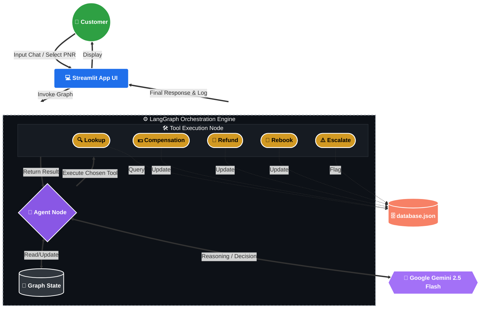

# ✈️ SkyConnect Airlines - Disruption Resolution Agent

Welcome to the **SkyConnect Airlines Disruption Resolution Agent**, a production-ready, AI-powered customer service system built with **LangGraph**, **Streamlit**, and **Gemini 2.5 Flash**. 

This system acts as a highly capable Level 1 Customer Support Agent, designed to handle real-world airline disruption scenarios autonomously while strictly adhering to company policies.

---

## 📖 Project Overview
This project simulates a real-world customer-facing resolution agent. Instead of a hardcoded or static dictionary, it uses a **Synthetic File-Based Dynamic JSON Database** (`database.json`). 

When a customer complains, the AI Agent:
1. **Verifies** the customer's identity and booking details dynamically via the database.
2. **Evaluates** the disruption (cancellation, delay).
3. **Applies Policy Rules** to issue compensations, process refunds, or rebook flights.
4. **Escalates** complex or prohibited requests to human supervisors seamlessly.

---

## 🛠️ Technology Stack
- **Framework:** LangGraph (for state management, tool execution, and workflow orchestration)
- **UI:** Streamlit (Custom styled for a premium, non-robotic, human-friendly interface)
- **LLM:** Google Gemini (`gemini-2.5-flash`) via `langchain-google-genai`
- **Database:** Synthetic dynamic JSON database managed via `core/db_manager.py`
- **Language:** Python 3.11+

---

## 🏗️ System Architecture



---

## 🗄️ Synthetic Database Architecture (`database.json`)
To mimic a real-world enterprise environment, the application relies on a synthetic database containing 50+ realistic airline customer profiles, loyalty tiers, and booking records.

**Why a synthetic database?**
- To enforce grounding. The agent cannot hallucinate flight details; it must actively fetch and verify that a flight was actually booked by the person before taking any action.
- To maintain state. Actions like applying compensation or initiating refunds update the database directly, reflecting real-time changes in the customer's profile.

### Mandatory Assignment Profiles (Included verbatim in the DB)
The database has been seeded with three specific real-world test cases:
1. **Priya Nair (Gold, PNR: SK4821X)**
   - *Issue:* Flight SK-204 (Delhi->Goa) Cancelled. 
   - *Demand:* Full refund AND a free upgrade to business class.
2. **Arvind Kulkarni (Silver, PNR: TR1190B)**
   - *Issue:* Flight SK-118 (Mumbai->Bengaluru) Delayed 4h.
   - *Demand:* Demands hotel accommodation.
3. **Meher Kaur (Platinum, PNR: WL7742)**
   - *Issue:* Flight SK-305 (Delhi->Hyderabad) Delayed 6h. 
   - *Demand:* Full night's hotel stay + ₹2,000 fare difference covered for an earlier flight.

---

## ⚖️ Core Policies and Constraints (Strictly Enforced)

The Agent has been programmed with strict grounding instructions to follow the company's Data Pack policies.

### 1. Verification Protocol
- The agent **MUST** fetch customer details using their PNR before taking any action. No action can be performed on unverified bookings.

### 2. Mandatory Escalation Triggers
The agent is explicitly forbidden from fulfilling certain requests and must immediately **Escalate to a Human Supervisor** if the customer requests:
- **Legal Action:** Any threat of legal action or lawsuits.
- **Fare Differences > ₹1,500:** The agent cannot cover fare differences exceeding this amount.
- **Upgrades:** Any request for cabin class upgrades (e.g., Economy to Business).
- **Payment Method Changes:** Requests to refund to a different payment method/bank account.
- **Extra Compensation:** Demanding compensation beyond the allowed policy limit.

### 3. Delay Compensation Policy
- **< 2 Hours:** No compensation.
- **2 - 4 Hours:** Meal voucher.
- **4 - 5 Hours:** Meal voucher + Lounge access.
- **> 5 Hours:** Meal voucher + Lounge access + **Hotel accommodation ONLY for the duration of the delay** (Full night stays are denied and escalated if demanded).

### 4. Cancellation Policy
For airline-caused cancellations, the customer is entitled to:
- A full 100% cash refund to the original payment method (Processing time: 7 days).
- **OR** Rebooking on the next available flight at no extra charge.
- *Loyalty Perks:* Gold and Platinum members get priority seating on rebooked flights.

---

## 🤖 Agent Tools
The agent uses 5 explicit tools to interact with the database and resolve issues:
1. `lookup_customer_booking`: Fetches customer details via PNR.
2. `apply_delay_compensation`: Calculates delay hours and applies exact policy-tier compensation.
3. `initiate_refund`: Cancels the flight and logs a 100% refund.
4. `rebook_on_next_flight`: Rebooks the customer on the next available flight (with loyalty priority logic).
5. `escalate_to_supervisor`: Flags the database and stops AI interaction when a mandatory escalation rule is triggered.

---

## 🚀 How to Run Locally

### 1. Install Dependencies
```bash
pip install -r requirements.txt
```

### 2. Configure Environment Variables
Create a `.env` file in the root directory and add your Google Gemini API key:
```env
# Get your API key at https://aistudio.google.com/app/apikey
GEMINI_API_KEY=your_actual_gemini_api_key_here
```

### 3. Start the Application
Run the Streamlit server:
```bash
streamlit run app.py
```

### 4. Testing
Once the UI loads, you can use the **Sidebar** to test the 3 mandatory scenarios or select any of the 50 synthetic PNRs from the dropdown to test edge cases.

---
*Built for Assignment 3 — Customer-Facing Resolution Agent (Airline Disruptions)*
